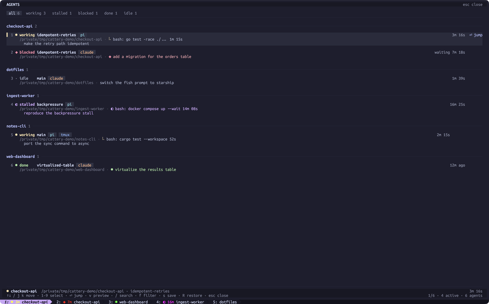
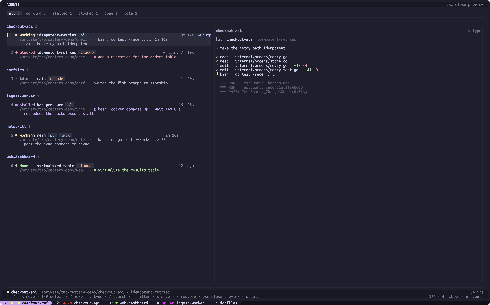

# cattery

Coding agents management overlay for [Kitty](https://sw.kovidgoyal.net/kitty/).

Coding agents run for minutes in windows you are not watching. Cattery marks
each tab with what its agent is doing, notifies you when one needs an answer,
and lists them all in a picker.



<details>
<summary>Press <code>v</code> for the screen of the agent under the cursor</summary>



</details>

## Install

With Homebrew:

```bash
brew tap alexander-akhmetov/cattery https://github.com/alexander-akhmetov/cattery
brew install cattery
cattery setup
```

Or with Go:

```bash
go install github.com/alexander-akhmetov/cattery/cmd/cattery@latest
cattery setup
```

Reload kitty afterwards.

`cattery setup` installs copies of the kitty files, and an upgrade of the binary
does not update those copies. Run it again after every upgrade. Restart kitty after.

`cattery setup` also offers to install the pi extension and the Codex plugin:

```bash
pi install git:github.com/alexander-akhmetov/cattery
codex plugin marketplace add alexander-akhmetov/cattery
codex plugin marketplace upgrade cattery
codex plugin add cattery-codex@cattery
```

Say yes after every upgrade. The picker warns about stale kitty files, but
nothing notices a stale pi extension or a stale Codex plugin: both are fetched
from the published repository rather than from the binary.

Codex hooks are trust-gated. Open `/hooks` in Codex and trust each
`cattery-codex@cattery` entry. Until you do, Codex skips them without a word.

`cattery -version` prints the release the binary was built from. `cattery help`
lists the commands, and `cattery help <command>` says what one of them does.

## Quick start

1. Run `cattery setup` and restart kitty.
2. Start an agent in a kitty tab. Currently only Claude Code, Codex and Pi are supported.
3. Press `opt+a` (`alt+a`) twice for the overlay in any kitty tab, which lists every running agent.

There is nothing to configure per agent or per project. `cattery setup` wires up
Claude Code and Codex, the pi extension covers pi, and from then on every agent
you start reports itself.

## The overlay

`opt+a` `opt+a` opens it from any kitty tab. It lists every running agent,
grouped by git repository, and Enter takes you to the one under the cursor.

| Key | Does |
|---|---|
| `j` `k`, `↑` `↓` | move the cursor |
| `1`-`9` | put the cursor on that row |
| `g`, `G` | first row, last row |
| `enter` | go to the agent: focus its kitty tab, or open a viewer for a tmux pane |
| `v` | open the preview drawer; press again to type at the agent |
| `/` | search every field on a row: repository, branch, directory, prompt, tool |
| `f` | cycle the state filter: all, working, stalled, blocked, done, idle |
| `s`, `R` | save a snapshot of the tab tree, restore one |
| `q`, `esc` | close |

A row for a pi agent names the tool it is running and how long that one call has
taken, above the prompt it is working on:

```
  2 ● working wt/publish-running-tool  pi                       3m 12s
    ~/…/myapp · ⠹ bash: go test -race ./... 1m 04s
      publish the running tool
```

The time appears after ten seconds. Only pi reports its tool; a Claude row shows
its prompt.

### The preview drawer

`v` shows the screen of the agent under the cursor, beside the list. It works on
a kitty window you are not looking at and on a tmux pane nobody is attached to.

The drawer opens read-only, framed in grey. Keys still move the cursor, so you
can walk down the list and watch each agent in turn.

Press `v` again to type at the agent. The frame turns red, and every key goes to
the agent: `q`, `enter`, `ctrl+c` to interrupt it. `esc` is the exception, so
`ctrl+]` sends a literal escape.

`esc` walks back out one step at a time:

| From | `esc` does |
|---|---|
| read-write (red frame) | gives the keyboard back to the picker |
| read-only (grey frame) | closes the drawer |
| no drawer | closes the picker |

The drawer needs about 91 columns, and says so instead of opening when the
terminal is narrower. It shows the left-hand columns of a wider screen, so boxes
are cut off on the right, and there is no cursor.

### Snapshots

`s` writes every kitty tab, its layout, and each agent's resume command to a
session file. `R` opens those tabs again and types each resume command at its
prompt, without pressing return. `cattery save` and `cattery restore` do the
same from a shell.

The resume command is `claude --resume <id>`, `codex resume <id>` or
`pi --session <file>`. If you start agents through a wrapper, export the command
cattery should write instead, before the agent starts:

```bash
export CATTERY_RESUME_PREFIX_CLAUDE="claude --profile personal"
```

`CATTERY_RESUME_PREFIX_CODEX` and `CATTERY_RESUME_PREFIX_PI` do the same for
Codex and pi, and `CATTERY_RESUME_PREFIX` for all three.

tmux agents are not recorded: a pane belongs to whatever started it.

## Tab markers

Each agent's tab shows what it is doing, so you can see all of them at once.

| State | Marker | Meaning |
|---|---:|---|
| `blocked` | red `◆` | the agent is waiting for your answer |
| `stalled` | magenta `◐` | one tool call has run past ten minutes |
| `done` | green `●` | the agent finished while you were looking elsewhere |
| `working` | yellow `●` | the agent is running |
| `idle` | none | nothing to report |

A `working`, `blocked` or `stalled` tab also shows how many minutes it has been
that way. An OS window with a `blocked`, `stalled` or `done` agent in it gets a
`(N need you)` title prefix, which the Dock and the ⌘-Tab switcher pick up.

Focus a `done` window and the marker goes away. Only pi reports which tool it is
running, so a Claude or Codex agent never reaches `stalled`.

A Claude or Codex tab that goes `blocked` stays red until the turn ends, even
after you answer. Neither agent reports going back to work, so the next thing
cattery hears is the end of the turn.

## Notifications

A banner fires when an agent goes `blocked`, `stalled` or `done`, unless you are
already looking at its window. kitty sends it, so there is nothing else to
install.

Click it to go to that agent, switching OS window if needed. The
**Open picker** button opens the overlay instead and leaves your focus alone; on
macOS it is a drop-down menu you get by hovering the banner.

Banners are silent: macOS cannot pick a sound per state. `blocked` asks for a
higher urgency, which Linux honours and macOS ignores.

## tmux agents

An agent running in a tmux pane appears in the overlay beside the kitty ones, in
the same repository groups, marked with a `tmux` chip, whether or not anybody
is attached to the pane.

Those agents get no tab marker and no notification, because a pane has no kitty
tab to mark.

Enter opens a kitty tab showing that pane, read-only: keys do nothing, and your
terminal size does not resize the agent's pane. `prefix d` closes it. A second
Enter goes back to the tab already showing it. From a shell it is
`cattery attach dev:3.%17`. Attaching this way clears a `done` row; a plain
`tmux attach` does not.

The viewer is read-only, the drawer is not. `v` `v` types at a tmux pane the
same way it types at a kitty window, so you can watch a pane in one tab and
answer it from the drawer. Needs tmux 3.1 or later.

If an agent does not show up, check what it wrote on its pane:

```bash
tmux list-panes -a -F '#{pane_id} #{@AGENT_STATE} #{@AGENT_KIND} #{@AGENT_TOOL}'
```

## Events

`cattery events` prints one line per agent state transition, so something other
than cattery can react to them:

```console
$ cattery events
{"ts":1755302096,"window":363,"kind":"pi","from":"idle","to":"working","title":"~/projects/myapp","cwd":"/Users/you/projects/myapp","msg":"fix the picker","focused":false}
{"ts":1755302241,"window":363,"kind":"pi","from":"working","to":"blocked","title":"~/projects/myapp","cwd":"/Users/you/projects/myapp","msg":"fix the picker","focused":false}
```

Each line is one JSON object:

| Field | Meaning |
|---|---|
| `ts` | unix seconds |
| `window` | the kitty window id |
| `kind` | what the agent calls itself, `pi`, `claude` or `codex`, empty on a `cleared` event from Claude or Codex |
| `from` | the state before this change, `null` the first time the window is seen |
| `to` | `working`, `stalled`, `blocked`, `done`, `idle`, `cleared` when the agent dropped its state, `closed` when the window went away |
| `title` | the window title, cut to 200 characters |
| `cwd` | the agent's directory |
| `msg` | the prompt the agent is on |
| `focused` | whether you were looking at the window |

A worked subscriber, one desktop notification for every agent that stops for an
answer:

```bash
cattery events | jq -r --unbuffered 'select(.to == "blocked") | .cwd' |
  while read -r cwd; do terminal-notifier -title "agent blocked" -message "$cwd"; done
```

Nothing is stored. An event that fires while nobody is subscribed is gone, and
there is no replay.

Three more things to know:

* tmux agents emit nothing.
* Subscribing needs the files `cattery setup` installs, so run setup again after
  upgrading the binary.
* A kitty restart drops every subscription. `cattery events` exits 3 when it
  notices, so a supervisor can start it again.
